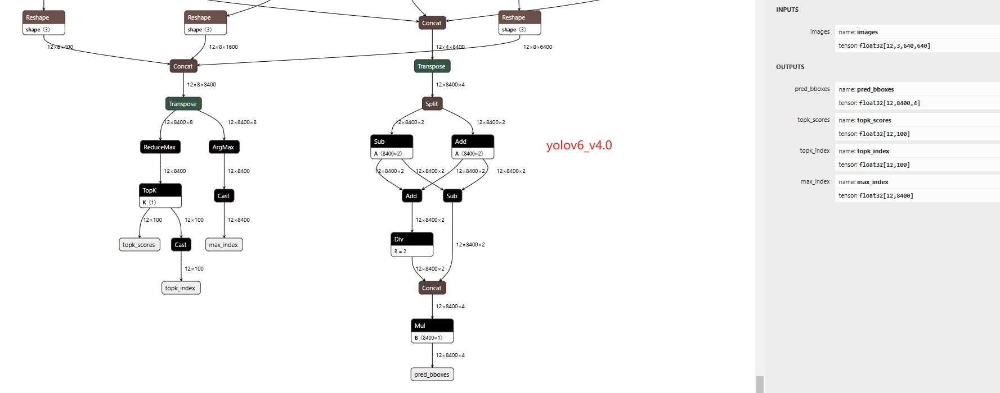

# ONNX模型SOPHON平台部署(以yolov6为例)


## 环境配置

- Ubuntu18.04/Ubuntu20.04

- cmake, git, make等等,根据实际情况缺什么安装什么

- [23.09 LTS SP4](https://sophon-assets.sophon.cn/sophon-prod-s3/drive/24/12/31/10/SDK-23.09-LTS-SP4.zip)

- [third_party&dependencies](https://pan.baidu.com/s/10V4dOLx2nzG2XJhnXD5PxQ?pwd=2jgi)

- `yolov6 4.0`

  
  
  [模型转换](models/README.md)

## 工程结构

```
.
├── SopHON_YoloV6
├── dependencies
├── third_party
```

## 构建

```shell
cd $ROOT_DIR
mkdir build && cd build
cmake ../ -DCMAKE_BUILD_TYPE=Release-DENGINE_LOWER=bm1684x -DCMAKE_SYSTEM_NAME=Linux -DSYSTEM_ABI=aarch64 -DCMAKE_CXX_COMPILER=/usr/bin/aarch64-linux-gnu-g++ -DCMAKE_C_COMPILER=/usr/bin/aarch64-linux-gnu-gcc
```
输出产物在`ROOT_DIR/bin/Linux`下面，拷贝到板子跑即可。


## 参考资料

- [YOLOv5_fuse](https://github.com/sophgo/sophon-demo/blob/release/sample/YOLOv5_fuse)

- [sophgo SDK文档](https://developer.sophgo.com/site/index/material/all/all.html)
